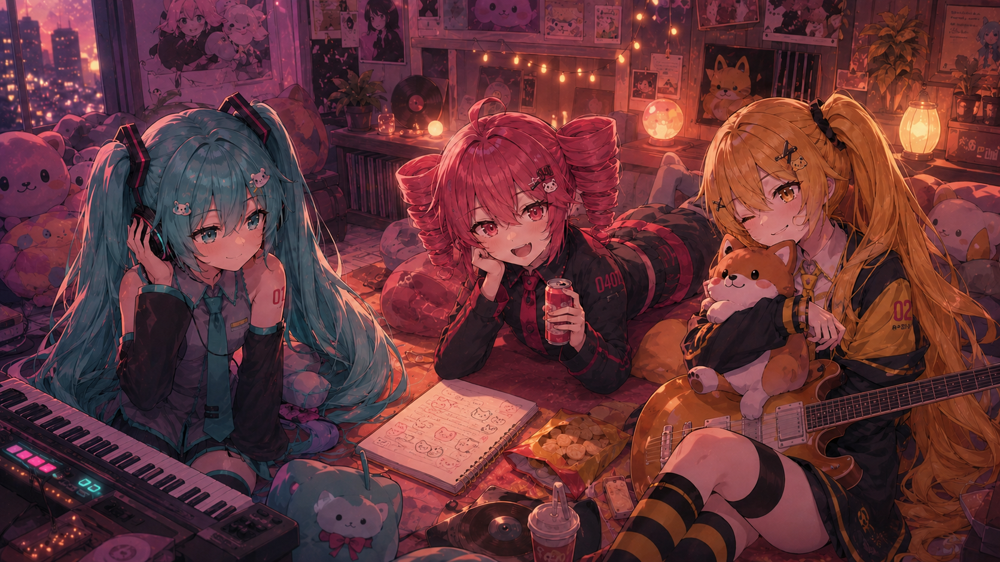
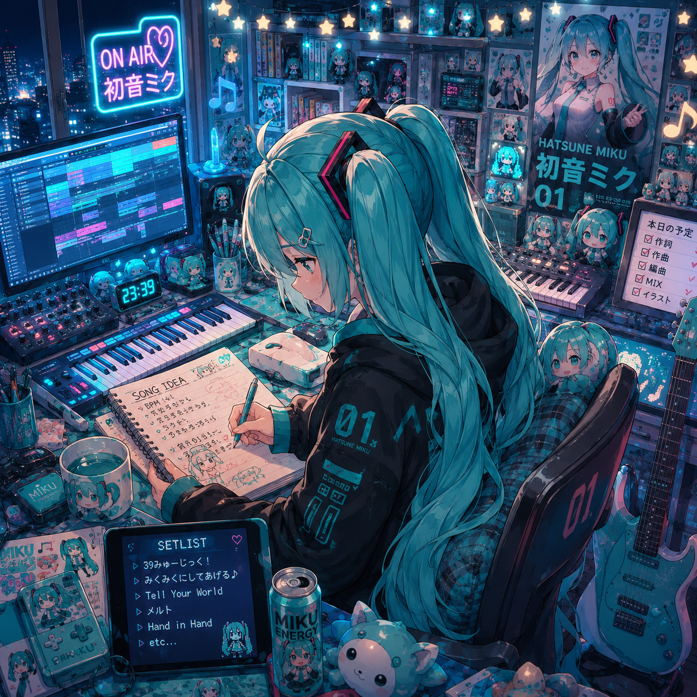
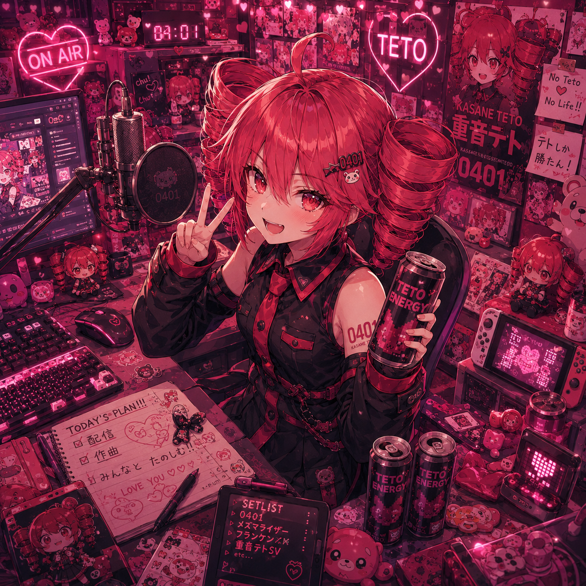
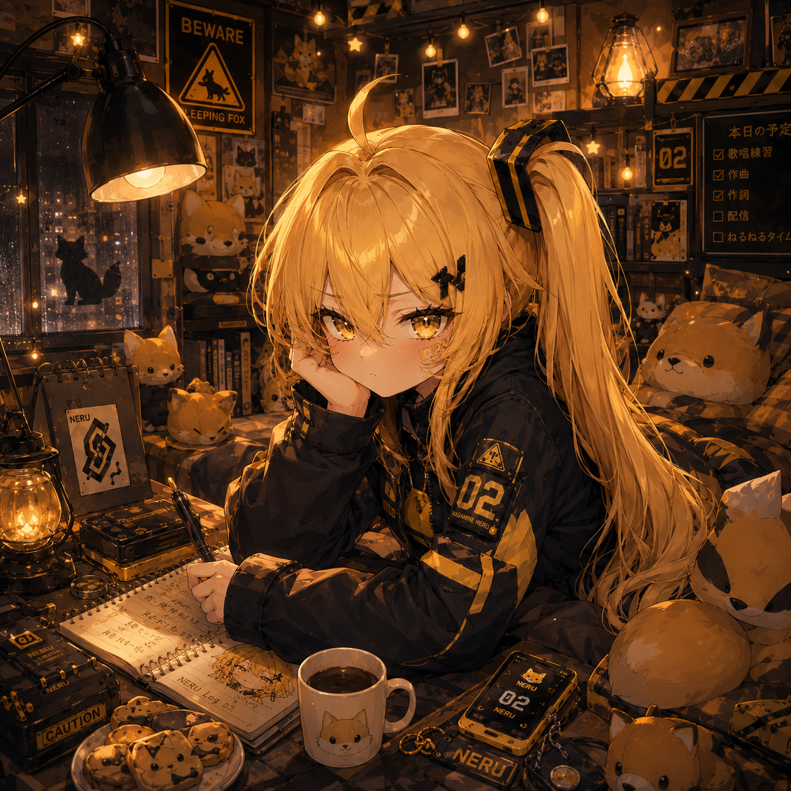
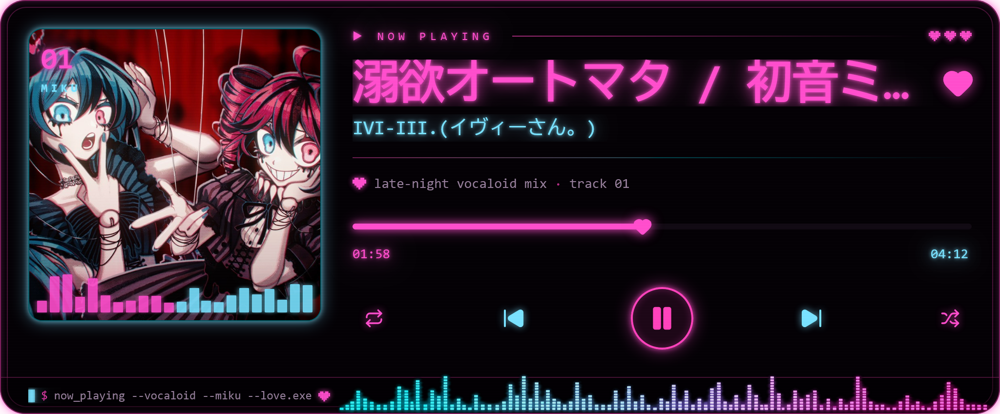

<p align="center">
  
</p>

<h1 align="center">⌁ NARU K / なる ⌁</h1>

<p align="center">
  <strong>Vocalo-P · software &amp; security engineer · AI researcher</strong><br>
  <em>when a weird idea slides in my head, something weird was born</em>
</p>

<p align="center">
  
</p>

<p align="center">
  <a href="https://therxwold.dev"></a>
  <a href="https://tryhackme.com/p/narukoshin"></a>
</p>

<p align="center">
  <a href="https://x.com/naruki8_"></a>
  <a href="mailto:k@narukoshin.me"></a>
  
</p>

---

## `01 // SIGNAL FOUND`

```yaml
artist: Naru K
class: [Vocalo-P, software engineer, security engineer, researcher]
main_instrument: [keyboard, guitar]
favorite_signal: "a synthetic voice through a distorted mix"
current_obsessions:
  - Hatsune Miku
  - Kasane Teto
  - foxes and terminal windows
  - tools that should probably have been smaller
  - AI characters with memory, voice, and presence
runtime: "mostly after midnight"
status: "building the next thing before finishing the previous thing"
```

> [!NOTE]
> This profile is part studio, part workshop, and part research archive. Expect music, security tooling, strange experiments, unfinished signals, and the occasional fox.

## `02 // CURRENT SETLIST`

| track | project | transmission |
|:--:|:--|:--|
| `01` | **[EnRaiJin](https://github.com/narukoshin/EnRaiJin)** | A configurable Go HTTP brute-forcer for authorized web security testing. |
| `02` | **[Yako](https://github.com/narukoshin/yako)** | A password manager/vault that works on my rules. |
| `03` | **[PROJECT ÞERXWOLD](https://therxwold.dev)** | My latest project related to AI/ML research touching AI Vtuber, music and tools. |
| `∞` | **[all repositories](https://github.com/narukoshin?tab=repositories)** | Tools, systems, security research, experiments, and several questionable late-night ideas. |

<p align="center">
  
  
  
</p>

<p align="center">
  <code>MIKU // melody</code>　·　<code>TETO // chaos</code>　·　<code>NERU // voltage</code>
</p>

## `03 // NOW PLAYING`

<p align="center">
    
</p>

<p align="center">
  
</p>

<p align="center">
  <code>Go</code> · <code>Python</code> · <code>Shell</code> · <code>JavaScript / TypeScript</code> · <code>Linux</code> · <code>security</code> · <code>music production</code>
</p>

## `04 // GITHUB, BUT MAKE IT PINK`

<p align="center">
  
</p>

<p align="center">
  
  
</p>

<details>
  <summary><strong>open the studio notes</strong></summary>
  <br>

  - I like projects with a strong identity, even when a boring name would be easier.
  - Gold-winning strategy - 1 weird idea + another weird idea = masterpiece.
  - As many other people I'm also sometimes wondering what I'm doing with my life. (it is what it is)
  - Music and software use the same part of my brain: layers, timing, tension, release.
  - Security work belongs in authorized environments. Curiosity is not permission.
  - ÞERXWOLD is where the AI-character research, music, and stranger ideas converge.
  - The foxes are non-negotiable.
</details>

## `05 // CUTENESS — THE GIFS STAY`

<p align="center">
  
  &nbsp;&nbsp;
  
  &nbsp;&nbsp;
  
</p>

<p align="center">
  <sub>音楽・コード・夜更かし // music, code, and staying up too late</sub><br>
  <strong>— transmission continues —</strong>
</p>
